# Personal Homepage Creation Tutorial

English Version | [中文版](README_zh.md)

This repository contains a clean personal homepage template. This tutorial will guide you on how to fork this project and add your own information to create your personal homepage.

**Disclaimer: This project template is only for research and learning purposes, and is not intended for any commercial use.**

**If you use this project template to create your personal homepage, you need to ensure that you comply with all relevant laws and regulations, and do not use it for any commercial activities.**

---

Update: 2025-09-15

**Excursion ConsHein 2.0 is officially launched!**

**Here's a summary of all the updates in Homepage 2.0!**

- More stunning UI and clearer, more user-friendly features!

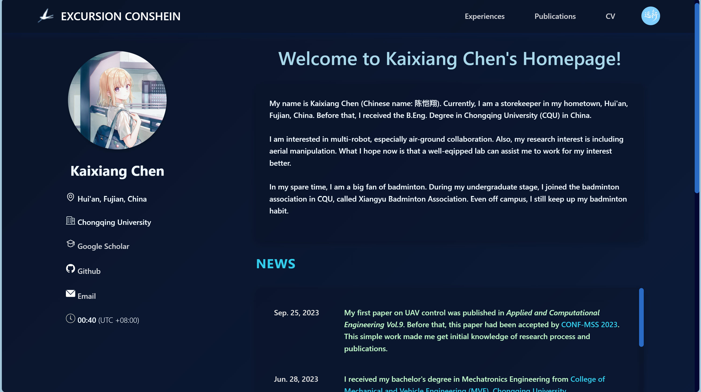

- The Experiences section has been revamped, categorizing the original institutional experiences as Institution Experiences, rather than direct Experiences


- The Publications section has also been upgraded, categorizing the original papers as Academic Papers, rather than direct Publications

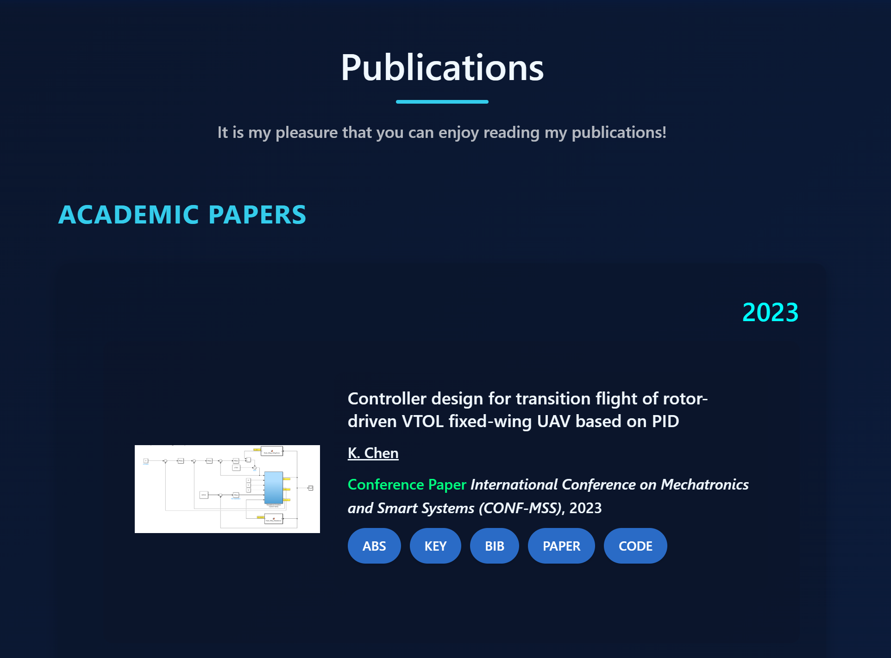

- The CV section has also been enhanced with titles and subtitles

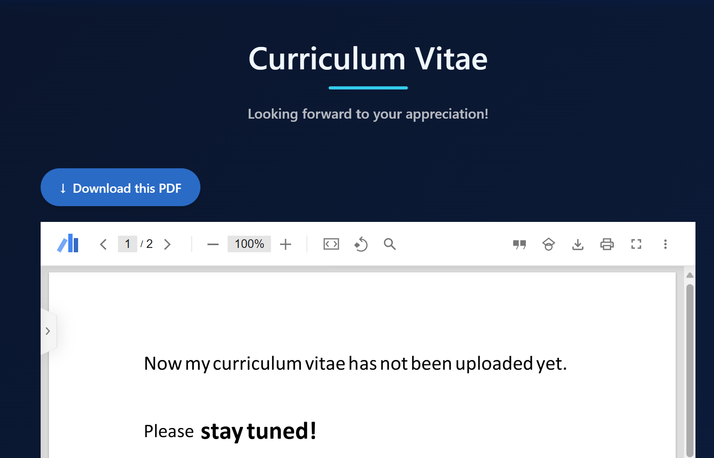

- Added the Excursion ConsHein and "远行鸽" (Traveling Pigeon) logo in the top left corner


**Dual-platform design for a more sensory-responsive experience!**

- The computer version offers a smoother experience with seamless page transitions

- The mobile version has a dedicated page for the information sidebar, click on the Traveling Pigeon to jump to it!

**Hope you can have a good experience with Excursion ConsHein 2.0 today!**

The old version of the personal homepage template is stored in `src/index_origin.html`.

---

## 1. Project Introduction

This is a personal homepage template based on HTML and JavaScript, with the following features:
- Clean and beautiful interface design
- Configuration file based content management
- No programming experience required for customization
- Support for displaying personal information, experiences, honors, papers, etc.

Note that this homepage supports both horizontal and vertical screen adaptation (computer, mobile), as shown below:
- Computer (horizontal screen)

 

- Mobile (vertical screen)

 

## 2. Getting Started

### Step 1: Fork the Repository

1. Visit the [Excursion-ConsHein.github.io](https://github.com/Excursion-ConsHein/Excursion-ConsHein.github.io) repository
2. Click the "Fork" button in the upper right corner to copy the repository to your GitHub account
3. Clone the forked repository to your local machine:
   ```bash
   git clone https://github.com/{your-username}/{your-repo-name}.github.io.git
   ```
   Where {your-username} is your GitHub username and {your-repo-name} is the name of your forked repository.
   
   For example, if your username is ConsHein and your repo name is Excursion-ConsHein.github.io, you should run:
   ```bash
   git clone https://github.com/ConsHein/Excursion-ConsHein.github.io.git
   ```
   This will clone the repository into a directory named `Excursion-ConsHein.github.io` on your local machine.

### Step 2: Directory Structure

The project directory structure is as follows:
```
├── README.md              # Project documentation (this tutorial)
├── index.html             # Main HTML file
├── configs/               # Configuration files
│   ├── cv.pdf             # Resume PDF
│   ├── experiences.json   # Work and education experiences
│   ├── honors.json        # Honors and awards
│   ├── info.json          # Basic personal information
│   ├── intro.txt          # Introduction text
│   ├── news.json          # Latest news
│   ├── papers.json        # Published papers
│   ├── patents.json       # Patents
│   ├── reviewer.json      # Reviewer experiences
│   └── teaching.json      # Teaching experiences
└── images/                # Image files
    ├── experience/        # Experience related images
    ├── homepage/          # Homepage images
    │   ├── background/    # Background images
    │   ├── favicon/       # Website icons
    │   ├── homekey/       # Homepage button images
    │   ├── info icon/     # Information icons
    │   └── photo/         # Personal photos
    ├── preview/           # Images for readme
    └── publication/       # Publication related images
```

## 3. Customize Your Information

**Note: All the following legend content is only for demonstration purposes and does not represent real information!**

### Modify Basic Personal Information

Edit the `configs/info.json` file to add your personal information:
```json
{
  "name": "Your Name",
  "address": "Your Address",
  "institution": "Your Institution",
  "google scholar": "Your Google Scholar Link",
  "github": "Your GitHub Link",
  "email": "Your Email",
  "UTC": "Your Time Zone, e.g. +8, default is +8",
}
```

 


### Add Experiences

Edit the `configs/experiences.json` file to add your work and education experiences:
```json
[
    {
        "logoSrc": "Logo of your school/organization, stored in images/experience/ directory",
        "school": "School Name",
        "details": [
            {
                "degree": "Degree",
                "major": "Major",
                "college": "College",
                "time": "Time"
            },
            // If you have multiple experiences in the same organization, you can continue adding here...
        ],
        "link": "School Link"
    },
    // If you have experiences in other organizations, you can continue adding here...
]
```

 


### Add Honors and Awards

If you don't have any honors or awards, you can leave the document empty or delete it, and the corresponding section will be hidden.

Edit the `configs/honors.json` file:
```json
[
    {
        "time": "Award Year",
        "award": "Award Name",
        "unit": "Awarding Unit"
    },
    // If you have multiple honors and awards, you can continue adding here...
]
```

 

### Add Teaching Experiences

If you don't have any teaching experiences, you can leave the document empty or delete it, and the corresponding section will be hidden.

Edit the `configs/teaching.json` file:
```json
[
    {
        "school": "School Name",
        "course": "Course Name",
        "code": "Course Code",
        "identity": "Identity, e.g. Assistant/Instructor",
        "season": "Season, e.g. Fall/Spring",
        "year": "Year",
        "link": "Course Link, if none, you can delete this line"
    },
    // If you have multiple teaching experiences, you can continue adding here...
]
```

 

### Add Reviewer Experiences

If you don't have any reviewer experiences, you can leave the document empty or delete it, and the corresponding section will be hidden.

Edit the `configs/reviewer.json` file:
```json
[
    {
        "conference": "Reviewer Conference Name",
        // If the reviewer's target is a journal, write as "journal": "Journal Name"
        "year": "Reviewer Year"
    },
    // If you have multiple reviewer experiences, you can continue adding here...
]
```

 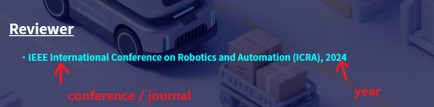

### Add Papers

Edit the `configs/papers.json` file:
```json
{
  "Year": [
    {
      "title": "Paper Title",
      "authors": "Author List",
      "type": "Paper Type, Journal/Conference",
      "conference": "Conference Name",
      // The above is an example for conference papers, for journal papers, use "journal": "Journal Name",
      "image": "Paper image, stored in images/publication/ directory",
      "award": "Awards received by the paper, if none, you can delete this line",
      "abstract": "Paper Abstract",
      "keyword": "Paper Keywords",
      "bibtex": "Paper BibTeX Citation",
      "paperLink": "Paper Link",
      "videoLink": "Embedded Video Link, if none, you can delete this line",
      "codeLink": "Code Repository Link, if none, you can delete this line",
      "siteLink": "Custom Project Page Link, if none, you can delete this line",
      "selectedPaper": true
      // If you want to feature this paper in the Research Highlights section on the homepage, set selectedPaper to true, otherwise set to false
    },
    // If you have other papers in this year, you can continue adding here...
  ],
  // If you have papers in other years, you can continue adding here...
}
```

 

 

### Add Patents

If you don't have any patents, you can leave the document empty or delete it, and the corresponding section will be hidden.

Edit the `configs/patents.json` file:
```json
{
  "patents": [
    {
        "type": "Patent Type",
        "title": "Patent Title",
        "authors": "Author List",
        "number": "Patent Number",
        "date": "Authorization Date",
        "link": "Patent Link"
    },
    // If you have more patents, you can continue adding here...
  ]
}
```

 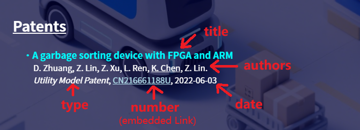

### Add Latest News

Edit the `configs/news.json` file:
```json
{
  "news": [
    {
        "time": "News Time, e.g. 2023-01-01",
        "content": "News Content"
    },
    // If you have more news, you can continue adding here...
  ]
}
```

 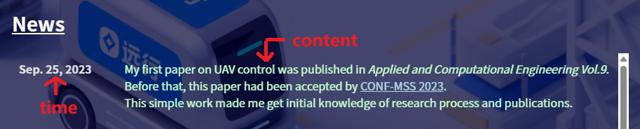

### Add Resume

Rename your resume PDF file to `cv.pdf` and replace the `configs/cv.pdf` file.

 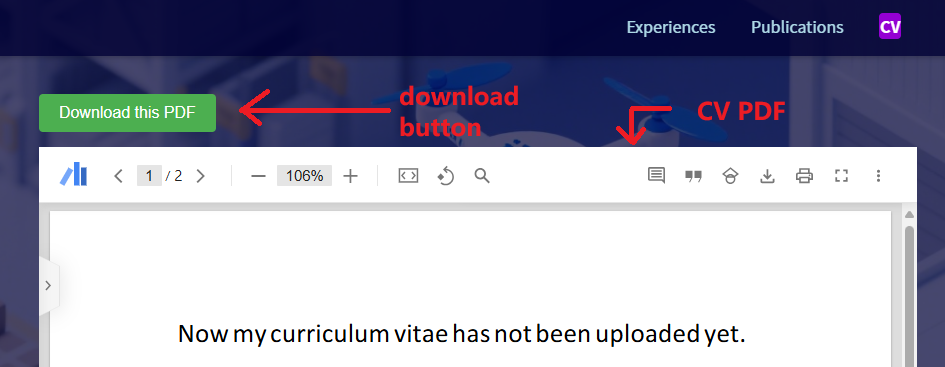

### Add Personal Introduction

Edit the `configs/intro.txt` file to add your personal introduction text.

 

## 4. Add Images

### Personal Photo

Replace your personal photo with the `images/homepage/photo/photo.png` file.

### Background and Icons

You can replace `images/homepage/background/BG.png` to change the background image, replace `images/homepage/favicon/favicon.ico` to change the website icon, and customize your homepage style.

 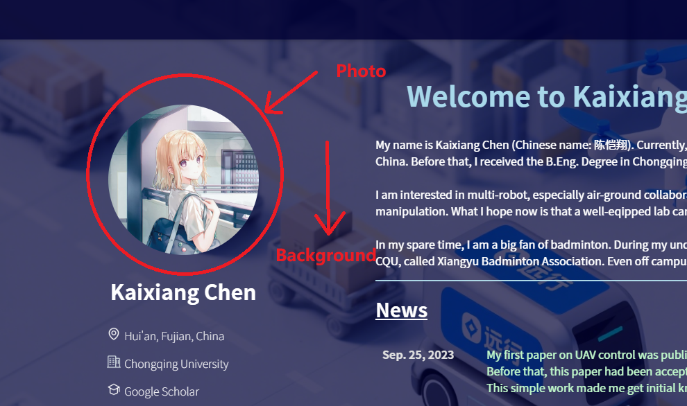

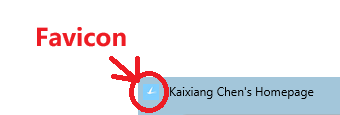

### Homepage Button Image

You can replace `images/homepage/homekey/homekey.png` to customize the appearance of the home button.

 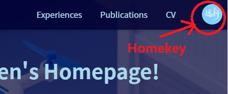

### Information Icons

You can replace the images in the `images/homepage/info icon/` directory to customize the information icons.

 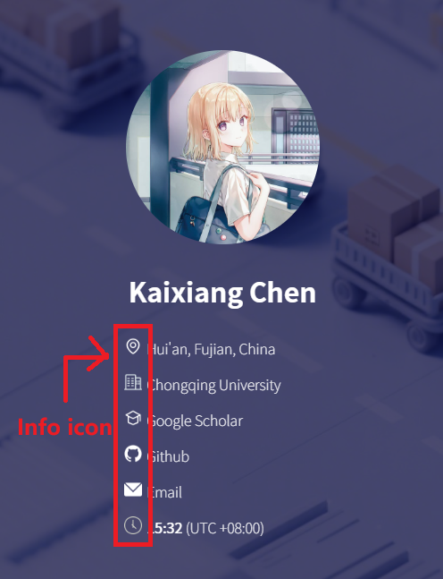  

### Clean Up Resources

You can delete the `images/preview` folder and clear the two README.md files to reduce the file size when committing, preventing push blocking.

## 5. Preview and Deployment

### Local Preview

1. Open the `index.html` file on your local computer to preview your personal homepage
2. For more advanced preview, you can use a local server, such as Python's simple HTTP server:
   ```bash
   cd your-repo-directory
   python -m http.server
   ```
3. Then visit `http://localhost:8000` in your browser

### Deploy to GitHub Pages

1. Ensure your repository name is in the format `your-username.github.io`
2. Commit and push all changes to GitHub:
   ```bash
   git add .
   git commit -m "Update personal information"
   git push origin main
   ```
3. Wait a few minutes, then visit `https://your-username.github.io` to see your personal homepage

## 6. Frequently Asked Questions

### Q: Do I need to know programming?
A: No. You just need to follow this tutorial to modify configuration files and add images.

### Q: How to customize the page style?
A: If you have HTML/CSS knowledge, you can modify the styles in the `index.html` file.

### Q: When will my homepage be updated?
A: After you push changes to GitHub, it usually updates within a few minutes.

## 7. Contact Us

If you encounter any issues during use, you can contact us through:
- Email: Conshein_Yuanxing@outlook.com
- GitHub: [Excursion-ConsHein](https://github.com/Excursion-ConsHein)

Good luck creating your amazing personal homepage!