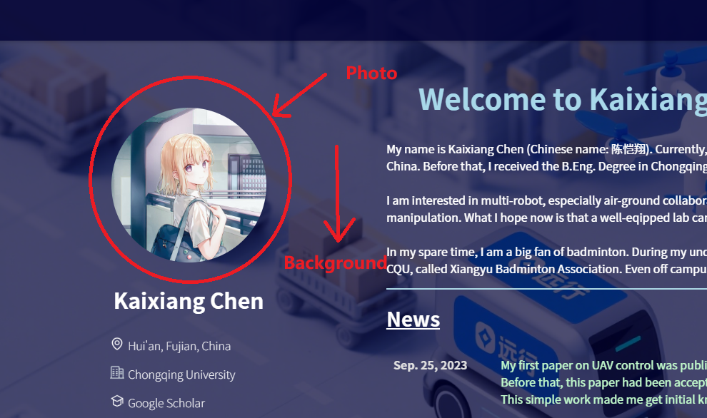
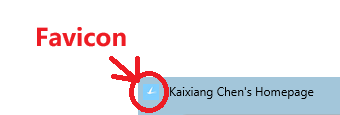
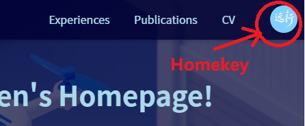
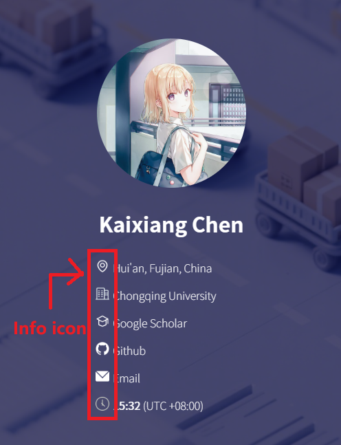

# Personal Homepage Creation Tutorial

English Version | [中文版](README_zh.md)

This repository contains a clean personal homepage template. This tutorial will guide you on how to fork this project and add your own information to create your personal homepage.

## 1. Project Introduction

This is a personal homepage template based on HTML and JavaScript, with the following features:
- Clean and beautiful interface design
- Configuration file based content management
- No programming experience required for customization
- Support for displaying personal information, experiences, honors, papers, etc.

Note that this homepage supports both horizontal and vertical screen adaptation (computer, mobile), as shown below:
- Computer (horizontal screen)


- Mobile (vertical screen)


## 2. Getting Started

### Step 1: Fork the Repository

1. Visit the [Excursion-ConsHein.github.io](https://github.com/Excursion-ConsHein/Excursion-ConsHein.github.io) repository
2. Click the "Fork" button in the upper right corner to copy the repository to your GitHub account
3. Clone the forked repository to your local machine:
   ```bash
   git clone https://github.com/your-username/your-repo-name.github.io.git
   ```

### Step 2: Directory Structure

The project directory structure is as follows:
```
├── README.md              # Project documentation (this tutorial)
├── index.html             # Main HTML file
├── configs/               # Configuration files
│   ├── cv.pdf             # Curriculum vitae PDF
│   ├── experiences.json   # Work and education experiences
│   ├── honors.json        # Honors and awards
│   ├── info.json          # Personal basic information
│   ├── intro.txt          # Introduction text
│   ├── news.json          # Latest news and updates
│   ├── papers.json        # Published papers
│   └── patents.json       # Patents
└── images/                # Image files
    ├── experience/        # Experience-related images
    ├── homepage/          # Homepage images
    │   ├── background/    # Background images
    │   ├── favicon/       # Website favicon
    │   ├── homekey/       # Homepage button images
    │   ├── info icon/     # Information icons
    │   └── photo/         # Personal photos
    └── publication/       # Publication-related images
```

## 3. Customize Your Information

### Modify Personal Basic Information

Edit the `configs/info.json` file to add your personal information:
```json
{
  "name": "Your Name",
  "address": "Your Address",
  "institution": "Your Institution",
  "google scholar": "Your Google Scholar Link",
  "github": "Your GitHub Link",
  "email": "Your Email",
  "UTC": "Your Time Zone, e.g. +8, default is +8",
}
```

### Add Experiences

Edit the `configs/experiences.json` file to add your work and education experiences:
```json
[
    {
        "logoSrc": "Logo of your school/organization, stored in images/experience/ directory",
        "school": "School Name",
        "details": [
            {
                "degree": "Degree",
                "major": "Major",
                "college": "College",
                "time": "Time Period"
            },
            // If you have multiple experiences in the same organization, you can continue adding here...
        ],
        "link": "School Link"
    },
    // If you have experiences in other organizations, you can continue adding here...
]
```

### Add Honors and Awards

Edit the `configs/honors.json` file:
```json
[
    {
        "time": "Award Year",
        "award": "Award Name",
        "unit": "Granting Unit"
    },
    // If you have more honors and awards, you can continue adding here...
]
```

### Add Papers

Edit the `configs/papers.json` file:
```json
{
  "Year": [
    {
      "title": "Paper Title",
      "authors": "Author List",
      "type": "Paper Type, Journal/Conference",
      "conference": "Conference Name",
      // The above is an example for conference papers, for journal papers, use "journal": "Journal Name",
      "image": "Paper image, stored in images/publication/ directory",
      "award": "Awards received by the paper, can be deleted if none",
      "abstract": "Paper Abstract",
      "keyword": "Paper Keywords",
      "bibtex": "Paper BibTeX Citation",
      "paperLink": "Paper Link",
      "videoLink": "Embedded Video Link, can be deleted if none",
      "codeLink": "Code Repository Link, can be deleted if none",
      "siteLink": "Project Website Link, can be deleted if none"
    },
    // If there are other papers in this year, you can continue adding here...
  ],
  // If there are papers in other years, you can continue adding here...
}
```

### Add Patents

Edit the `configs/patents.json` file:
```json
{
  "patents": [
    {
        "type": "Patent Type",
        "title": "Patent Title",
        "authors": "Author List",
        "number": "Patent Number",
        "date": "Authorization Date",
        "link": "Patent Link"
    },
    // If there are more patents, you can continue adding here...
  ]
}
```

### Add Latest News

Edit the `configs/news.json` file:
```json
{
  "news": [
    {
        "time": "News Time, e.g. 2023-01-01",
        "content": "News Content"
    },
    // If there are more news items, you can continue adding here...
  ]
}
```

### Add Resume

Rename your resume PDF file to `cv.pdf` and replace the `configs/cv.pdf` file.

### Add Personal Introduction

Edit the `configs/intro.txt` file to add your personal introduction text.

## 4. Add Images

### Personal Photos

Replace your personal photo with the `images/homepage/photo/photo.png` file.

### Background and Icons

You can replace `images/homepage/background/BG.png` to change the background image, and replace `images/homepage/favicon/favicon.ico` to change the website icon to customize your homepage style.





### Homepage Button Images

You can replace `images/homepage/homekey/homekey.png` to customize the appearance of the home button.



### Information Icons

You can replace the images in the `images/homepage/info icon/` directory to customize the information icons.



## 5. Preview and Deployment

### Local Preview

1. Open the `index.html` file on your local computer to preview your personal homepage
2. For a more advanced preview, you can use a local server, such as Python's simple HTTP server:
   ```bash
   cd your-repo-directory
   python -m http.server
   ```
3. Then visit `http://localhost:8000` in your browser

### Deploy to GitHub Pages

1. Ensure your repository name is in the format `your-username.github.io`
2. Commit and push all changes to GitHub:
   ```bash
   git add .
   git commit -m "Update personal information"
   git push origin main
   ```
3. Wait a few minutes, then visit `https://your-username.github.io` to see your personal homepage

## 6. Frequently Asked Questions

### Q: Do I need to know programming?
A: No. You just need to follow this tutorial to modify configuration files and add images.

### Q: How to customize the page style?
A: If you have HTML/CSS knowledge, you can modify the styles in the `index.html` file.

### Q: When will my homepage be updated?
A: After you push changes to GitHub, it usually updates within a few minutes.

## 7. Contact Us

If you encounter any issues during use, you can contact us through:
- Email: Conshein_Yuanxing@outlook.com
- GitHub: [Excursion-ConsHein](https://github.com/Excursion-ConsHein)

Good luck creating your amazing personal homepage!
